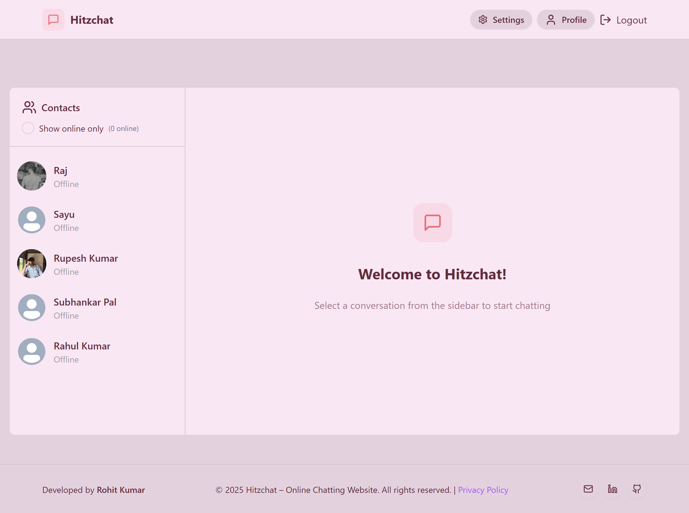

# 💬 HitzChat

A blazing-fast real-time chat application built with the MERN stack, powered by Socket.io, styled with TailwindCSS + DaisyUI, and themed with 32 gorgeous UI modes. 💥

---

## 🚀 Live Demo

🌍 Visit the live app:  
🔗 [https://hitzchat.onrender.com](https://hitzchat.onrender.com)

> ⏳ Note: The initial load may take a few seconds as the Render server may be waking up.

---

## ✨ Highlights

- 🌟 **Tech Stack**: `MongoDB + Express + React + Node.js` (MERN)
- 🔌 **Real-time Messaging** with `Socket.io`
- 🎨 **Beautiful UI** with `TailwindCSS` + `Daisy UI` (32 themes supported!)
- 🔐 **Authentication & Authorization** using `JWT`
- 🟢 **Online User Status** in real time
- 🌐 **Global State Management** with `Zustand`
- 🛠️ **Robust Error Handling** on both **Client & Server**
- 🧠 **Modern React** (Hooks, Lazy Loading, Code Splitting)

---

## 📸 Preview

.png)

---

## 🛠️ Tech Stack

| Technology     | Purpose                    |
|----------------|----------------------------|
| **MongoDB**    | Database                   |
| **Express.js** | Backend REST API           |
| **React.js**   | Frontend UI                |
| **Node.js**    | Server runtime             |
| **Socket.io**  | Real-time communication    |
| **TailwindCSS** + **DaisyUI** | Beautiful, responsive UI |
| **JWT**        | Secure login/authentication |
| **Zustand**    | Lightweight state management |

---

## 🔧 Features

- ✅ User Sign Up / Login
- ✅ JWT-based secure authentication
- ✅ Profile photo upload (Max 1 MB)
- ✅ Real-time 1-to-1 messaging via WebSockets
- ✅ Group chat support *(optional future)*
- ✅ Online/offline user indicators
- ✅ Theme switching with 32 DaisyUI themes
- ✅ Responsive layout for mobile & desktop
- ✅ Global error handling
- ✅ Logout/session management
- ✅ Modern and accessible UI/UX

---

## 🧑‍💻 Author

- **Rohit Kumar Saw**  
- 📧 [rohitku6207@gmail.com](mailto:rohitku6207@gmail.com)  
- 🔗 [LinkedIn](https://www.linkedin.com/in/rohit-kumar-saw6207/)  
- 💻 [GitHub](https://github.com/Rohitsaw6207)

---

## ⭐ Support

If you like this project, consider starring ⭐ the repository to support and inspire more work!

